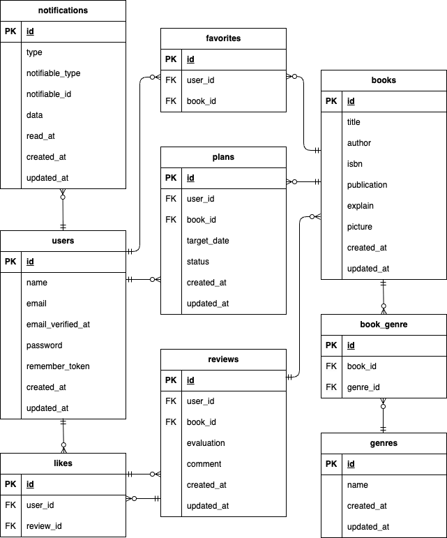

# BookShelf

## 環境構築

### リポジトリのクローン

#### リポジトリをクローンします。
git clone https://github.com/mana1218/bookshelf-app.git

cd bookshelf-app

#### Sailのコマンドを簡単に実行できるよう、aliasを設定します。
alias sail='sh $([ -f sail ] && echo sail || echo vendor/bin/sail)'

### .envファイルの作成

#### .env.exampleをコピーして.envを作成します。
cp .env.example .env

#### .envのデータベース設定が以下の内容になっていることを確認してください。
DB_CONNECTION=mysql
DB_HOST=mysql
DB_PORT=3306
DB_DATABASE=laravel
DB_USERNAME=sail
DB_PASSWORD=password

### Composerパッケージのインストール
docker run --rm \
  -u "$(id -u):$(id -g)" \
  -v "$(pwd):/var/www/html" \
  -w /var/www/html \
  -e COMPOSER_CACHE_DIR=/tmp/composer_cache \
  laravelsail/php82-composer:latest \
  composer install

  #### .envの設定を変更した場合は、設定キャッシュをクリアします。
sail artisan config:clear

### Laravel Sailの起動

#### Sailをバックグラウンドで起動します。
sail up -d

#### コンテナが起動していることを確認します。
sail ps
MySQLのステータスがhealthyになっていることを確認してください。

### アプリケーションキーの生成
sail artisan key:generate

### データベースのマイグレーションと初期データ投入

#### テーブルの作成と初期データの投入を行います。
sail artisan migrate --seed

#### 既存のデータベースをリセットして初期データを入れ直す場合は、以下を実行します。
sail artisan migrate:fresh --seed

### フロントエンドのセットアップ

#### NPMパッケージをインストールします。
sail npm install

### Viteの起動

#### フロントエンドの開発サーバーを起動します。
sail npm run dev
開発中はViteを起動した状態にしてください。

### アプリケーションへのアクセス

### phpMyAdmin

#### ブラウザから以下にアクセスします。
http://localhost:8080

### アプリケーション

#### ブラウザから以下にアクセスしてください。
http://localhost

## 使用技術（実行環境）

### 開発環境
#### PHP 8.5
#### Laravel 10.50.2
#### Laravel Sail
#### Laravel Notifications DatabaseChannel
#### Docker
#### Docker Compose
#### MySQL 8.4
#### phpMyAdmin

### 認証・API
#### Laravel Fortify
#### Laravel Sanctum
#### Laravel API Resource

### フロントエンド

#### Blade
#### Vite
#### Tailwind CSS ^3.4.0
#### @tailwindcss/forms

### 外部サービス

#### Google Books API

### 開発・テストツール

#### Postman
#### PHPUnit
#### Laravel Feature Test/Unit Test
#### Laravel Test Coverage
#### Laravel Pint

### バージョン管理

#### Git/GitHub

## 実装機能

### 認証機能

#### 会員登録
#### ログイン・ログアウト
#### Laravel Fortifyによる認証機能

### 書籍機能

#### 書籍一覧
#### 書籍詳細
#### 書籍登録・編集・削除
#### ISBNによる書籍情報検索
#### Google Books APIを利用した書籍情報の取得
#### 書籍の検索・フィルタリング
#### 登録日の新しい順・古い順などのソート

### ジャンル機能

#### ジャンル一覧
#### ジャンル登録・編集・削除
#### 書籍へのジャンル設定

### レビュー機能

#### レビュー投稿
#### レビュー編集・削除
#### 評価によるレビュー
#### レビューへのいいね

### お気に入り機能

#### 書籍のお気に入り登録・解除
####　お気に入り書籍一覧

### ランキング機能

####　レビューの平均評価をもとにした書籍ランキング
#### 上位10件の表示

### マイレポート機能

#### 読書計画やレビューなどのデータを利用した読書レポート表示

### 読書計画機能

#### 読書計画の登録・編集・削除
#### 読書計画の開始・完了
#### 期限による状態管理
#### 期限切れの自動判定

### 通知機能

####　読書計画の期限3日前の通知
####　読書計画の期限当日の通知
####　読書計画の期限超過時の通知
#### 通知をデータベースに保存

### 公開API

#### 書籍CRUD
####　ジャンルCRUD
#### レビューCRUD
#### ランキング取得
#### ISBNによる書籍検索
####　API ResourceによるJSONレスポンス
#### Laravel SanctumによるAPIトークン認証
#### 書籍の登録・更新・削除などの書き込み系APIを認証必須化

### バッチ処理

#### 読書計画の期限通知のバッチ
#### 期限切れ読書計画の自動失効バッチ
#### Laravel Schedule / Console Commandによる定期実行

## 機能詳細

### 認証機能

#### 会員登録
ユーザー名、メールアドレス、パスワードを入力して会員登録できます。

#### ログイン・ログアウト
登録したメールアドレスとパスワードを使用してログインできます。
ログイン後はログアウトすることで、認証状態を解除できます。

#### 認証が必要な機能へのアクセス制御
ログインが必要な機能には、未認証ユーザーがアクセスできないようアクセス制御を行っています。
書籍の登録・編集・削除、レビュー投稿、お気に入り登録、読書計画の登録など、ユーザーに紐づく機能はログインユーザーのみ利用できます。

### 書籍機能

#### 書籍一覧
登録されている書籍を一覧で表示します。
キーワード、ジャンル、評価などの条件による検索・フィルタリングに対応しています。
また、登録日の新しい順・古い順などで表示順を変更できます。

#### 書籍詳細
書籍のタイトル、著者、ISBN、出版日、説明、ジャンルなどの詳細情報を表示します。
ログインユーザーが書籍にお気に入りやレビューにいいねを登録・解除できます。
書籍にレビューを投稿できます。
書籍に投稿されたレビューを確認できます。

#### 書籍登録
ログインユーザーが書籍を登録できます。
ISBNを利用してGoogle Books APIから書籍情報を取得し、登録時の情報入力に利用できます。
登録した書籍にはジャンルを設定できます。

#### 書籍編集・削除
書籍の登録者本人のみ、登録した書籍の編集・削除を行えます。
編集・削除時にはPolicyによる認可処理を行っています。

### ジャンル機能

#### ジャンル一覧
登録されているジャンルを一覧で表示します。

#### ジャンル登録
ジャンル名を入力して、新しいジャンルを登録できます。

#### ジャンル編集・削除
登録済みのジャンルを編集・削除できます。

#### 書籍へのジャンル設定
書籍の登録・編集時に、書籍に紐づけるジャンルを設定できます。
1冊の書籍に複数のジャンルを設定できます。

#### ジャンル別書籍一覧
ジャンルを選択すると、そのジャンルが設定されている書籍を一覧で表示します。

### レビュー機能

#### レビュー投稿
ログインユーザーが書籍に対してレビューを投稿できます。
レビューには評価とコメントを設定できます。

#### レビュー編集・削除
自分が投稿したレビューのみ編集・削除できます。
Policyによる認可処理を行い、他のユーザーのレビューは編集・削除できないようにしています。

#### 評価によるレビュー
レビュー投稿時に書籍に対する評価を設定できます。
設定された評価はランキングなどの集計に利用されます。

#### レビューへのいいね
他のユーザーが投稿したレビューに対して、いいねを登録・解除できます。

### お気に入り機能

#### 書籍のお気に入り登録・解除
ログインユーザーが書籍をお気に入りに登録・解除できます。
同じ書籍を重複してお気に入り登録できないようにしています。

#### お気に入り書籍一覧
お気に入りに登録した書籍を一覧で確認できます。

### ランキング機能

#### レビューの平均評価をもとにした書籍ランキング
各書籍に投稿されたレビューの評価をもとに平均評価を算出し、平均評価の高い順に書籍を並べて表示します。
レビューが1件もない書籍はランキングの対象外としています。

#### 上位10件の表示
平均評価の高い書籍から上位10件を表示します。

### マイレポート機能

#### 基本統計
ログインユーザー自身の読書計画やレビューなどのデータを集計し、読書状況を確認できます。
・総レビュー数
・読了冊数
・平均評価

#### 評価分布
投稿したレビューの評価を集計し、評価ごとの件数をグラフで表示します。

#### 高評価書籍TOP5
評価が4以上の書籍を対象に、評価の高い書籍を上位5件まで表示します。

#### ジャンル別平均評価TOP5
ジャンルごとのレビュー評価を集計し、平均評価が高いジャンルを上位5件まで表示します。

### 読書計画機能

#### 読書計画の登録
読みたい書籍と目標期限を設定して、読書計画を登録できます。
同じ書籍について、期限が重複する読書計画は登録できないようにしています。

#### 読書計画の編集・削除
自分が登録した読書計画のみ編集・削除できます。
Policyによる認可処理を行っています。

#### 読書計画の開始・完了
登録した読書計画を開始し、読書が完了したら完了状態に変更できます。

#### 期限による状態管理
読書計画には「進行中」「読了」「期限切れ」などの状態を設定し、読書の進捗を管理します。

#### 期限切れの自動判定
目標期限を過ぎても読了していない読書計画は、期限切れとして扱います。

#### 状態による検索
進行中・読了・期限切れの状態を指定して、読書計画を絞り込んで表示できます。

### 通知機能

#### 期限3日前の通知
読書計画の期限3日前になると、対象ユーザーに期限が近づいていることを通知します。

#### 期限当日の通知
読書計画の期限当日になると、対象ユーザーに期限を知らせる通知をします。

#### 期限超過時の通知
読書計画の期限を過ぎても完了していない場合、対象ユーザーに期限超過を知らせる通知をします。

#### 通知の保存
Laravel Notificationsを利用し、通知内容をデータベースのnotificationsテーブルに保存します。
ユーザーは保存された通知を画面上で確認できます。

### 公開API
外部アプリケーションから利用できるJSON形式のAPIを提供しています。
APIは/api/v1配下にまとめています。

#### 書籍API
・書籍一覧取得
・書籍詳細取得
・ISBNによる書籍検索
・書籍登録
・書籍編集
・書籍削除

#### ジャンルAPI
ジャンルの一覧・登録・詳細・編集・削除を行えます。

#### レビューAPI
レビューの投稿・編集・削除を行えます。

#### ランキングAPI
レビューの評価をもとにした書籍ランキングを取得できます。

#### API Resource
APIのレスポンスにはLaravel API Resourceを使用し、JSON形式でデータを返します。

#### Sanctumによる認証
書籍・レビューなどの書き込み系APIではLaravel Sanctumによるトークン認証を必須としています。
認証されたユーザーのみ、書籍やレビューの登録・編集・削除を行えます。
また、書籍の編集・削除ではBookPolicyを使用し、書籍の所有者のみ操作できるよう認可しています。

### バッチ処理

#### 読書計画の期限通知バッチ
Laravel ScheduleとConsole Commandを使用し、読書計画の期限に応じた通知処理を定期的に実行します。
期限3日前、期限当日、期限超過の読書計画を判定し、対象ユーザーに通知を作成します。

#### 期限切れ読書計画の自動判定
目標期限を過ぎても読了していない読書計画を期限切れとして判定し、ステータスを更新します。

#### 定期実行
Laravel ScheduleにConsole Commandを登録し、定期的にバッチ処理を実行します。

## テスト
PHPUnitおよびLaravelのFeature Test・Unit Testを使用してテストを実施しています。

### テスト内容
#### 認証機能
#### 書籍CRUD
#### レビュー機能
#### ジャンル機能
#### お気に入り機能
#### レビューへのいいね
#### ランキング機能
#### 読書計画機能
#### 通知機能
#### 公開API

### カバレッジ
テストカバレッジは以下のコマンドで確認できます。

./vendor/bin/sail artisan test --coverage --min=60

最終的なテストカバレッジは 80.5% です。

## APIエンドポイント一覧

### APIのベースURLは/api/v1です。
POST /api/v1/login APIログイン・トークン発行 認証不要
GET /api/v1/books 書籍一覧取得 認証不要
POST /api/v1/books 書籍登録 認証必須
GET /api/v1/books/isbn/{isbn} ISBNによる書籍検索 認証不要
GET /api/v1/books/{book} 書籍詳細取得 認証不要
PUT /api/v1/books/{book} 書籍更新 認証必須
DELETE /api/v1/books/{book} 書籍削除 認証必須
POST /api/v1/books/{book}/reviews レビュー登録 認証必須
GET /api/v1/genres ジャンル一覧取得 認証不要
POST /api/v1/genres ジャンル登録 認証不要
GET /api/v1/genres/{genre} ジャンル詳細取得 認証不要
PUT / PATCH /api/v1/genres/{genre} ジャンル更新 認証不要
DELETE /api/v1/genres/{genre} ジャンル削除 認証不要
GET /api/v1/ranking 書籍ランキング取得 認証不要
PUT / PATCH /api/v1/reviews/{review} レビュー更新 認証必須
DELETE /api/v1/reviews/{review} レビュー削除 認証必須

## Bladeの変更
配布されたBladeテンプレート内で使用されていた変数名を、実装したモデル・コントローラーに合わせるため、$readingplan→$planに変更しています。

## ER図
